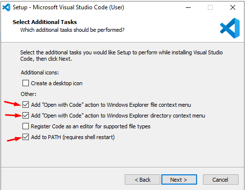
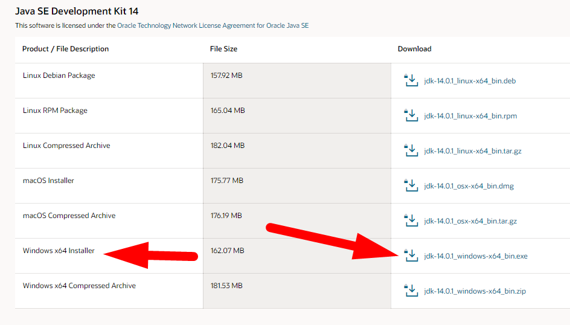
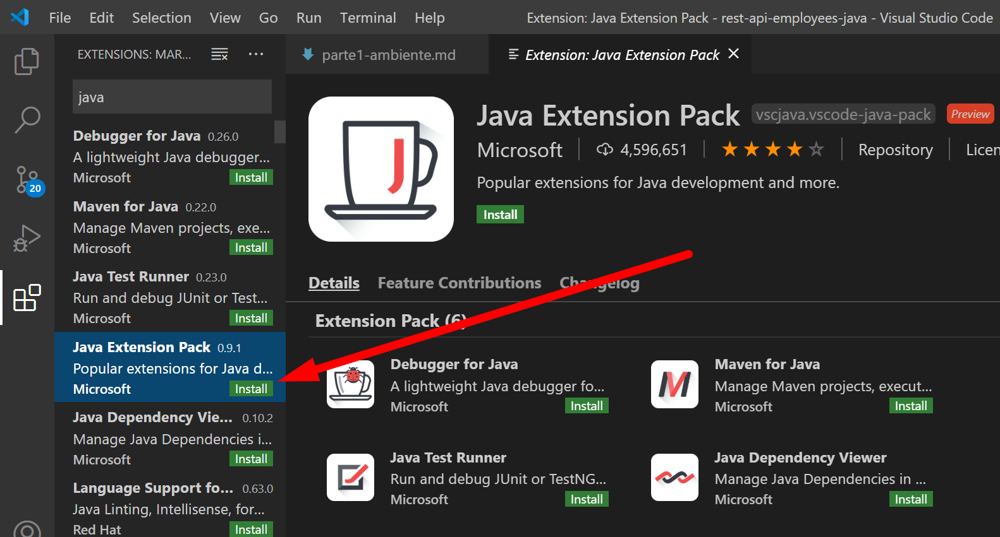
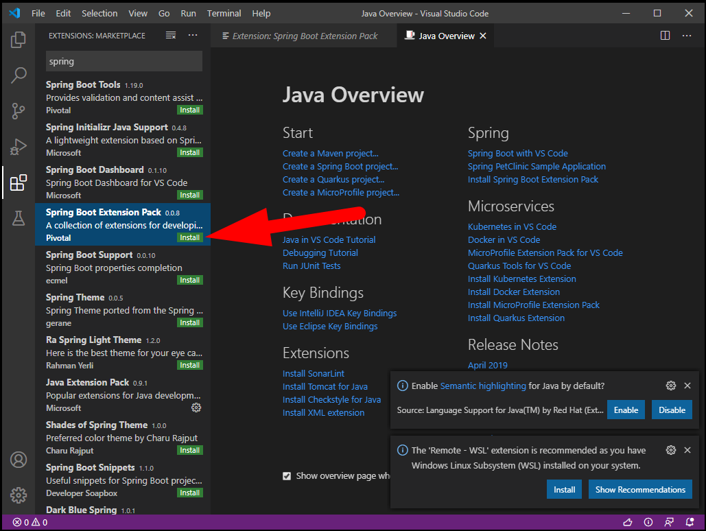
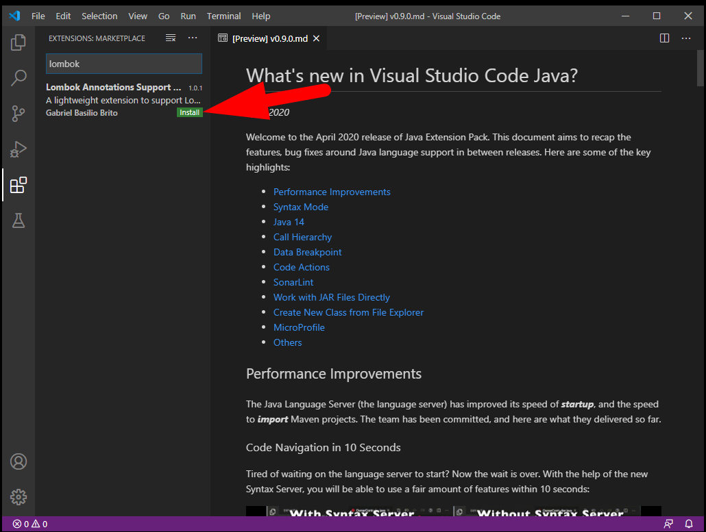

# Criando uma WebAPI com Java

## Parte 1 - Preparando o ambiente

Nesta etapa será feita a preparação do ambiente de desenvolvimento.

Serão instalados:
 - Visual Studio Code (VSCode)
 - JDK14
 - Extenções do VSCode


Embora existam algumas IDEs (Integrated Development Environment) especializadas para desenvolvimento em Java (Eclipse, Netbeans, IntelliJ), neste tutorial vamos utilizar o Visual Studio Code (VSCode)!!!


---
### Instalando o Visual Studio Code (VSCode)

Baixe a versão estável (Stable Build) do site [https://code.visualstudio.com/](https://code.visualstudio.com/) e execute a instalação.

> **Dica** - Marque as opções **"Open with Code"** durante a instalação.
> 


---
### Instalando o JDK14

Baixe a versão mais atual do Java SE 14, no site [https://www.oracle.com/java/technologies/javase-jdk14-downloads.html](https://www.oracle.com/java/technologies/javase-jdk14-downloads.html).

> 

Configure as variáveis de ambiente do seu sistema:

 - Configure a variável **JAVA_HOME** para o diretório raiz onde foi instalado o Java (normalmente é C:\Program Files\Java\jdk-14.0.1);
 - Configure a variável **PATH**, adicionando a entrada ```%JAVA_HOME%\bin```

> Se tudo deu certo, ao entrar na linha de comando e digitar ```java -version``` deve ser apresentada a versão **java 14.0.1** no console.


---
### Instalando o Maven - gerenciador de pacotes e configurações do Java

Siga os procedimentos de instalação informados no link: [https://maven.apache.org/](https://maven.apache.org/)

> 


### Instalando o Tomcat

https://tomcat.apache.org/download-90.cgi


---
### Instalando os Plugins do Java no VSCode

- Localize e instale a extensão **Java Extension Pack** no VSCode.
  > 
  > Este pacote de extensões instala vários plugins de Java no VSCode.

- Localize e instale a extensão **Spring Boot Extension Pack** no VSCode.
  > 
  > Este pacote de extensões instala vários plugins do Spring no VSCode.
   
- Localize e instale a extensão **Lombok Annotations Support for VS Code** no VSCode.
  > 
  > Lombok é uma biblioteca Java que possibilita a geração automática de código por meio de Annotations. Consulte a seção [Referências](#referências) para mais informações.


---
### Verificando se tudo deu certo...


Vamos criar um projetinho Java com Spring, para verificar se tudo está OK.

- Abra o VSCode, pressione **Ctrl + Shit + P**, digite: **spring init**, selecione a opção: **>Spring Initializr: Generate a Maven Project**
- Selecione a opção **Java** para gerenciar seu projeto
- Informe o nome do pacote (Group Id) (pode deixar com.example se preferir)
- Informe o nome do artefato (Artifact Id) (pode deixar demo se preferir)
- Especifique a versão do Spring: **2.3.1**

- Adicione as dependências: **Lombok, Spring Boot DevTools, Spring Web**
  > 

- Selecione um diretório para salvar o seu projeto, e em seguida abra o
  > 

- Abra o diretório src\main\java\com\example\demo e crie o arquivo DemoController.java
  ```java
  package com.example.demo;
  
  import org.springframework.web.bind.annotation.RestController;
  import org.springframework.web.bind.annotation.GetMapping;
  
  @RestController
  public class DemoController {
      @GetMapping(value = "/")
      public String get() {
          return "OK";
      }
  }
  ```

- Execute o projeto em modo Debug, pelo **SPRING-BOOT DASHBOARD**:
  > 

- Acesse seu navegador web, na url: **http://localhost:8080** - deve ser apresentado **OK** na tela


---
### Referências
 
 - [Visual Studio Code](https://code.visualstudio.com)
 - [Java + VSCode](https://www.youtube.com/watch?v=vim1bTa-Bkc)
 - [Java VSCode Spring](https://www.youtube.com/watch?v=dkmlOi_MNb4)
 - [Java VSCode Maven Tomcat](https://www.youtube.com/watch?v=23rN0oDdOKg)
 - [Using VS Code with Java and Maven projects](https://vaadin.com/learn/tutorials/vs-code-for-java-and-maven-projects)
 - [Building REST services with Spring](https://spring.io/guides/tutorials/rest/)
 - [Spring Boot Maven Plugin Documentation](https://docs.spring.io/spring-boot/docs/2.3.1.RELEASE/maven-plugin/reference/html/)
