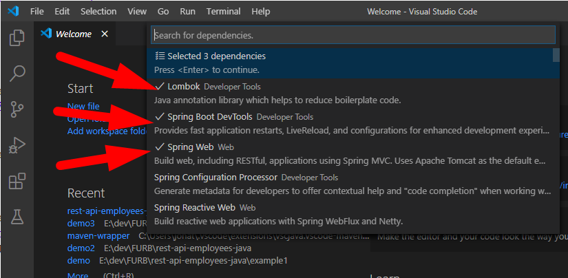
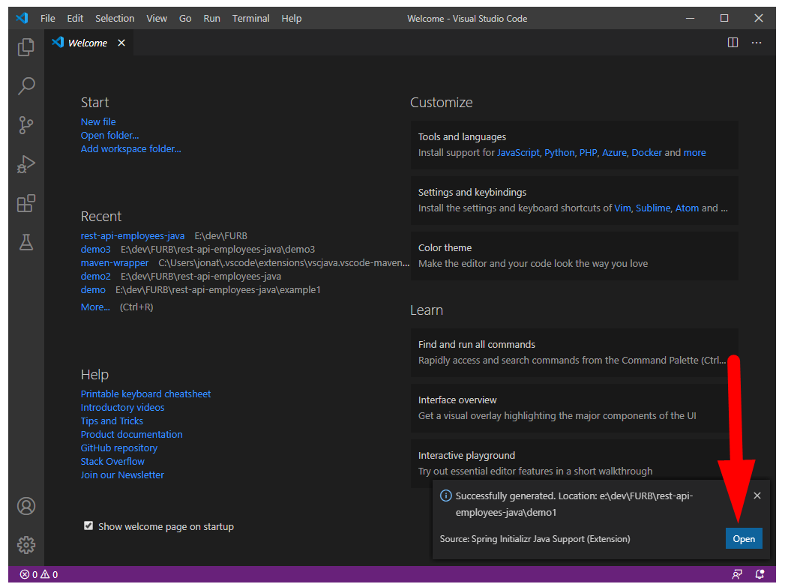
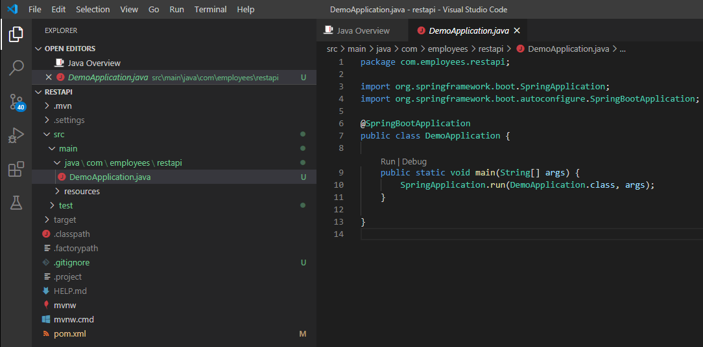
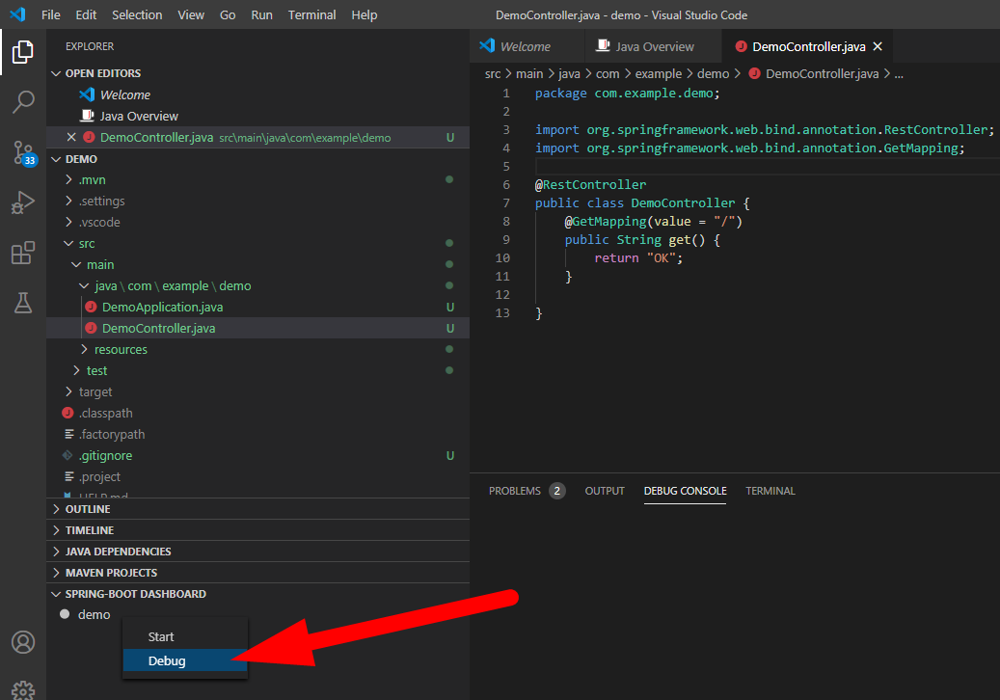

# Criando uma WebAPI com Java

## Parte 2 - Criando a WebAPI

Nesta etapa será implementada uma WebAPI simples, utilizando Java.


---
### Resultado esperado

Será criada uma WebAPI muito simples para cadastro de Empregados.

As operações esperadas na WebAPI são:

- GET /api/employees -> lista todos os empregados cadastrados
- GET /api/employees/:id -> busca um empregado cadastrado, pelo id
- POST /api/employees -> cadastra um novo empregado
- PUT  /api/employees/:id -> atualiza os dados de um empregado já cadastrado
- DELETE /api/employees/:id -> excluir um empregado cadastrado

**[Acesse a documentação completa da API, para mais detalhes](https://employees38.docs.apiary.io/)**


---
### Criando o projeto

#### Criando a estrutura básica do projeto utilizando VSCode

- Abra o VSCode, pressione **Ctrl + Shit + P**, digite: **spring init**, selecione a opção: **>Spring Initializr: Generate a Maven Project**
- Selecione a opção **Java** como a linguagem para o seu projeto
- Informe o nome do pacote (Group Id): com.employees
- Informe o nome do artefato (Artifact Id): restapi
- Especifique a versão do Spring: **2.3.1**

- Adicione as dependências: **Lombok, Spring Boot DevTools, Spring Web**, depois pressione <Enter> para continuar
  > 

- Selecione um diretório para salvar o seu projeto, e em seguida abra-o
  > 

- Os arquivos do projeto serão criados automaticamente:
  > 


#### Criando a entidade Employee
 
- Organizando diretórios da aplicação:
  ```console
  mkdir src\main\java\com\employees\restapi\models
  ```
- Crie o arquivo Employee.java no diretório models com o seguinte código:
  ```java
  package com.employees.restapi.models;
  
  import lombok.Data;
  
  @Data
  public class Employee {
      private long id;
      private String name;
      private Float salary;
      private Integer age;
      private String ProfileImage;
  }
  ```


#### Criando a entidade ErrorEntity
 
- Esta classe será utilizada para retornar mensagens de erro.
- Crie o arquivo ErrorEntity.java no diretório models com o seguinte código:
  ```java
  package com.employees.restapi.models;
  
  import lombok.AllArgsConstructor;
  import lombok.Data;
  
  @Data
  @AllArgsConstructor
  public class ErrorEntity {
      private String errorMessage;
  }
  ```


#### Criando a interface IEmployeesService.cs

Foi utilizado na aplicação o padrão de projeto de Camada de Serviço/ServiceLayer. Consute as [referências](#referências) para mais informações.

- Organizando diretórios da aplicação:
  ```console
  mkdir src\main\java\com\employees\restapi\services
  ```
- Crie a interface IEmployeesService dentro do diretório services:
  ```java
  package com.employees.restapi.services;
  
  import java.util.Collection;
  import com.employees.restapi.models.Employee;
  
  public interface IEmployeesService {
      public Collection<Employee> listAll();  
      public Employee getById(int id);
      public Employee add(Employee employee);
      public Employee update(Employee employee);
      public Employee deleteById(int id);
  }
  ```


#### Criando o controller EmployeesController.cs

- Organizando diretórios da aplicação:
  ```console
  mkdir src\main\java\com\employees\restapi\controllers
  ```
- Crie o arquivo EmployeesController dentro do diretório controllers:
  ```java
  package com.employees.restapi.controllers;
  import java.util.Collection;
  import com.employees.restapi.models.Employee;
  import com.employees.restapi.models.ErrorEntity;
  import com.employees.restapi.services.IEmployeesService;
  import org.springframework.beans.factory.annotation.Autowired;
  import org.springframework.http.HttpStatus;
  import org.springframework.http.ResponseEntity;
  import org.springframework.web.bind.annotation.PathVariable;
  import org.springframework.web.bind.annotation.RequestBody;
  import org.springframework.web.bind.annotation.RequestMapping;
  import org.springframework.web.bind.annotation.RequestMethod;
  import org.springframework.web.bind.annotation.RestController;
  
  @RestController
  public class EmployeesController {
  
      private IEmployeesService service;
	  
	  @Autowired
      public EmployeesController(IEmployeesService service) {
          this.service = service;
      }
  
      // GET /api/employees - retornar a lista de employees
      @RequestMapping(value = "/api/employees", method = RequestMethod.GET)
      public ResponseEntity<Collection<Employee>> listAll() {
          Collection<Employee> list = service.listAll();
          return new ResponseEntity<Collection<Employee>>(list, HttpStatus.OK);
      }
  
      // GET /api/employees/1 - retorna employee com o id 1
      @RequestMapping(value = "/api/employees/{id}", method = RequestMethod.GET)
      public ResponseEntity<Employee> buscar(@PathVariable("id") long id) {
          Employee employee = service.getById(id);
          if (employee == null) {
              return new ResponseEntity<>(HttpStatus.NOT_FOUND);
          }
          return new ResponseEntity<Employee>(employee, HttpStatus.OK);
      }
  
      // POST /api/employees - cria um novo employee
      @RequestMapping(value = "/api/employees", method = RequestMethod.POST, consumes = "application/json")
      public ResponseEntity<?> criar(@RequestBody Employee employee) {
          if (employee == null) {
              return new ResponseEntity<>(HttpStatus.NOT_FOUND);
          }
          if (employee.getName() == null || employee.getName().isEmpty()) {
              ErrorEntity error = new ErrorEntity("The name field is required!");
              return new ResponseEntity<ErrorEntity>(error, HttpStatus.BAD_REQUEST);
          }
          Employee result = service.add(employee);
          return new ResponseEntity<Employee>(result, HttpStatus.OK);
      }
  
      // PUT /api/employees - atualiza employee com id 1
      @RequestMapping(value = "/api/employees/{id}", method = RequestMethod.PUT, consumes = "application/json")
      public ResponseEntity<?> atualizar(@RequestBody Employee employee, @PathVariable("id") long id) {
          if (employee == null) {
              return new ResponseEntity<>(HttpStatus.NOT_FOUND);
          }
          if (employee.getName() == null || employee.getName().isEmpty()) {
              ErrorEntity error = new ErrorEntity("The name field is required!");
              return new ResponseEntity<ErrorEntity>(error, HttpStatus.BAD_REQUEST);
          }
          employee.setId(id);
          Employee result = service.update(employee);
          return new ResponseEntity<Employee>(result, HttpStatus.OK);
      }
  
      // DELETE /api/employees/1 - deleta employee com id 1
      @RequestMapping(value = "/api/employees/{id}", method = RequestMethod.DELETE)
      public ResponseEntity<Employee> deletar(@PathVariable("id") int id) {
          Employee employee = service.deleteById(id);
          if (employee == null) {
              return new ResponseEntity<>(HttpStatus.NOT_FOUND);
          }
          return new ResponseEntity<Employee>(employee, HttpStatus.OK);
      }
  }  
  ```


#### Criando a interface IEmployeesRepository

Foi utilizado na aplicação o padrão de projeto Repository para abstrair a camada de dados. Consute as [referências](#referências) para mais informações.

- Organizando diretórios da aplicação:
  ```console
  mkdir src\main\java\com\employees\restapi\repositories
  ```
- Crie a interface IEmployeesRepository dentro do diretório repositories:
  ```java
  package com.employees.restapi.repositories;
  
  import java.util.Collection;
  import com.employees.restapi.models.Employee;
  
  public interface IEmployeesRepository {
      public Collection<Employee> listAll();
      public Employee getById(long id);
      public Employee add(Employee employee);
      public Employee update(Employee employee);
      public Employee deleteById(long id);
  }
  ```


#### Implementando a interface IEmployeesService - com a classe EmployeesService

> Por se tratar de uma aplicação simples não há regras de negócio, mas caso houvessem, estariam aqui.
> Nesta camada de serviços ficam as regras de negócio. Esta camanda de serviço utiliza os Repositórios para tratar dos dados (buscar, salvar, atualizar, deletar) e também contêm as regras de negócio da aplicação.

- Crie a classe EmployeesService, dentro do diretório services:
  ```java
  package com.employees.restapi.services;
  
  import java.util.Collection;
  import com.employees.restapi.models.Employee;
  import com.employees.restapi.repositories.IEmployeesRepository;
  import org.springframework.beans.factory.annotation.Autowired;
  import org.springframework.stereotype.Component;
  
  @Component
  public class EmployeesService implements IEmployeesService {
      private IEmployeesRepository repository;
      
	  
	  @Autowired
	  public EmployeesService(IEmployeesRepository repository) {
          this.repository = repository;
      }
  
      @Override
      public Collection<Employee> listAll() {
          // TODO regras de negócio, se tiver
          return repository.listAll();
      }
  
      @Override
      public Employee getById(long id) {
          // TODO regras de negócio, se tiver
          return repository.getById(id);
      }
  
      @Override
      public Employee add(Employee employee) {
          // TODO regras de negócio, se tiver
          // Exemplo: enviar email para o RH com os dados do empregado adicionado
          return repository.add(employee);
      }
  
      @Override
      public Employee update(Employee employee) {
          // TODO regras de negócio, se tiver
          return repository.update(employee);
      }
  
      @Override
      public Employee deleteById(long id) {
          // TODO regras de negócio, se tiver
          return repository.deleteById(id);
      }
  }
  ```


#### Implementando a interface IEmployeesRepository - com a casse EmployeesRepositoryMemory

Esta camada abstrai o banco de dados.

Neste exemplo, vamos apenas salvar os dados na memória da aplicação. Posteriormente vamos persistir em banco de dados.

- Crie a classe EmployeesRepositoryMemory dentro do diretório repositories:
  ```java
  package com.employees.restapi.repositories;
  import java.util.Collection;
  import java.util.HashMap;
  import com.employees.restapi.models.Employee;
  import org.springframework.stereotype.Component;
  
  @Component
  public class EmployeesRepositoryMemory implements IEmployeesRepository {
  
      private static Long idCount = 0L;
      private static HashMap<Long, Employee> map = new HashMap<Long, Employee>();
  
      @Override
      public Collection<Employee> listAll() {
          return map.values();
      }
  
      @Override
      public Employee getById(long id) {
          if (map.containsKey(id))
              return map.get(id);
          else
              return null;
      }
  
      @Override
      public Employee add(Employee employee) {
          idCount++;
          employee.setId(idCount);
          map.put(employee.getId(), employee);
          return employee;
      }
  
      @Override
      public Employee update(Employee employee) {
          if (!map.containsKey(employee.getId()))
              return null;
          map.replace(employee.getId(), employee);
          return employee;
      }
  
      @Override
      public Employee deleteById(long id) {
          if (!map.containsKey(id))
              return null;
          var employee = map.get(id);
          map.remove(id);
          return employee;
      }
  }
  ```


---
### Execute a aplicação

Nesta etapa vamos compilar e executar a aplicação:

- Execute o projeto em modo Debug, pelo **SPRING-BOOT DASHBOARD**:
  > 


---
### Testando a aplicação com o Postman

Para testar os endpoints da aplicação, vamos utilizar o Postman

- Instale o Postman caso ainda não tenha instalado. [Site Postman](https://postman.com/) e consuma os endpoints da aplicação.
- A aplicação estará rodando nas urls:
  - http://localhost:8080/api/employees


---
### Referências
 
 - [ServiceLayer](https://trailhead.salesforce.com/pt-BR/content/learn/modules/apex_patterns_sl/apex_patterns_sl_learn_sl_principles)
 - [ServiceLayer](https://martinfowler.com/eaaCatalog/serviceLayer.html)
 - [Documentando APIs com apiary.io](https://apiary.io/)
 
 
 
