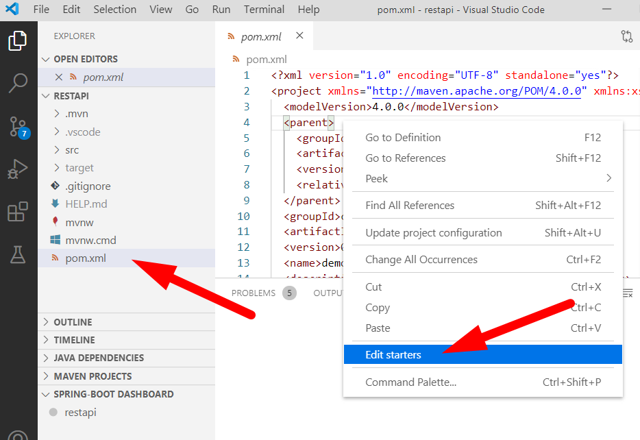
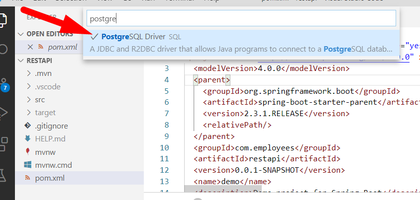

# Criando uma WebAPI com Java

## Parte 3 - Persistindo os dados no banco de dados PostgreSQL

Nesta etapa vamos persistir os dados dos empregados no banco de dados PostgreSQL, utilizando SQL Ansi.
Na próxima etapa vamos utilizar o PostgreSQL com JPA.

Será implementado uma nova classe para a interface ```IEmployeesRepository``` que salva os dados no PostgreSQL.


---
### Instalação do PostgreSQL

Você pode instalar o PostgreSQL no seu Windows ou instalar o **docker** e rodar o PostgreSQL pelo docker.

**Instalação nativa no Windows**

- Baixe e instale o PostgreSQL - [https://www.postgresql.org/](https://www.postgresql.org/)

**Rodar pelo docker**

- Instale o docker para o Windows
  - Acesse o link [de download do Docker](https://hub.docker.com/editions/community/docker-ce-desktop-windows/) e clique no botão **Get Docker**
  - Utilize a opção Linux, quando solicitado
- Após instalado, execute os comando para rodar um container do PostgreSQL:
  ```console
  docker run --name postgres -e POSTGRES_PASSWORD=postgres -d postgres
  ```
  > Para confirmar que o serviço está rodando, execute: ```docker ps``` e verifique se o container postgres foi listado.
  > Após rodar o container a primeira vez, para inicar o serviço novamente basta executar o comando: ```docker start postgres```


---
### Instalação de um Client para o PostgreSQL

Um software cliente para fazer consultas SQL no PostgreSQL será necessário.

A recomendação neste tutorial é utilizar o **Postbird**.

- entre no link [https://github.com/Paxa/postbird/releases](https://github.com/Paxa/postbird/releases) e baixe a versão para Windows mais atual


---
### Preparando o banco de dados

- Conectar no banco de dados:
  
- Criando uma nova Database: **employees**
  
- Selecione o banco criado **employees** e clique na aba **Query** para executar o script de criação da tabela **employees**
  ```sql
  create table employees (
    id SERIAL primary key not null,
    name varchar(255) not null,
    salary numeric(10,2),
    age int,
    profile_image varchar(255)
  )
  ```


---
### Adicionando o Drive do PostgreSQL no projeto

- Abra o arquivo ```pom.xml```
- Clique com o botão direito do mouse no conteúdo do arquivo, depois na opção **Edit starters**
  > 
- Procure pela biblioteca **PostgreSQL Driver** e marque-a para ser adicionada no projeto, depois pressione enter para continuar e aguarde a instalação:
  > 
- Como resultado, será adicionado a dependência do PostgreeSQL no seu seu arquivo pom.xml, contendo:
  ```xml
  <dependency>
    <groupId>org.postgresql</groupId>
    <artifactId>postgresql</artifactId>
    <scope>runtime</scope>
  </dependency>
  ```


---
#### Incluindo as configurações do banco PostgreSQL no arquivo application.properties

- Edite o arquivo ```application.properties```, localizado no diretório **src\main\resources**, incluindo as configurações do PostgreSQL
  ```none
  postgresql.connectionString=jdbc:postgresql://localhost:5432/employees
  postgresql.user=postgres
  postgresql.password=postgres
  ```


---
### Criando a classe EmployeesRepositoryPgSql

- Crie o arquivo **EmployeesRepositoryPgSql.java** dentro do diretório ```repositories``` nos seus arquivos fontes.
  ```java
  package com.employees.restapi.repositories;
  
  import java.math.BigDecimal;
  import java.sql.Connection;
  import java.sql.DriverManager;
  import java.sql.PreparedStatement;
  import java.sql.ResultSet;
  import java.sql.SQLException;
  import java.util.ArrayList;
  import java.util.Collection;  
  import com.employees.restapi.models.Employee;
  import org.springframework.beans.factory.annotation.Value;
  import org.springframework.stereotype.Component;
  
  @Component("employeesRepositoryPgSql")
  public class EmployeesRepositoryPgSql implements IEmployeesRepository {
      @Value("${postgresql.connectionString}")
      private String connectionString;
      @Value("${postgresql.user}")
      private String user;
      @Value("${postgresql.password}")
      private String password;
  
      @Override
      public Collection<Employee> listAll() {
          Connection conn = null;
          PreparedStatement stmt = null;
          ResultSet rs = null;
          try {
              Collection<Employee> result = new ArrayList<Employee>();
              conn = getConnection();
              stmt = conn.prepareStatement("select id, name, salary, age, profile_image from employees order by name");
              rs = stmt.executeQuery();
              while (rs.next()) {
                  Employee employee = GetEmployee(rs);
                  result.add(employee);
              }
              rs.close();
              stmt.close();
              return result;
          } catch (Exception e) {
              System.err.println(e.getClass().getName() + ": " + e.getMessage());
              e.printStackTrace();
          } finally {
              try {
                  conn.close();
              } catch (Exception e) {
              }
          }
          return null;
      }
  
      @Override
      public Employee getById(long id) {
          Connection conn = null;
          Employee result = null;
          try {
              conn = getConnection();
              return getById(id, conn);
          } catch (Exception e) {
              System.err.println(e.getClass().getName() + ": " + e.getMessage());
              e.printStackTrace();
          } finally {
              try {
                  conn.close();
              } catch (Exception e) {
              }
          }
          return result;
      }
  
      private Employee getById(long id, Connection conn) {
          PreparedStatement stmt = null;
          ResultSet rs = null;
          Employee result = null;
          try {
              conn = getConnection();
              stmt = conn.prepareStatement("select id, name, salary, age, profile_image from employees where id=?");
              stmt.setLong(1, id);
              rs = stmt.executeQuery();
              if (rs.next()) {
                  result = GetEmployee(rs);
              }
              rs.close();
              stmt.close();
          } catch (Exception e) {
              System.err.println(e.getClass().getName() + ": " + e.getMessage());
              e.printStackTrace();
          }
          return result;
      }
  
      @Override
      public Employee add(Employee employee) {
          Connection conn = null;
          PreparedStatement stmt = null;
          ResultSet rs = null;
          Employee result = null;
          try {
              conn = getConnection();
              stmt = conn.prepareStatement("insert into employees (name, salary, age, profile_image) values (?, ?, ?, ?) RETURNING id");
              stmt.setString(1, employee.getName());
              stmt.setBigDecimal(2, employee.getSalary());
              stmt.setObject(3, employee.getAge());
              stmt.setString(4, employee.getProfileImage());
              rs = stmt.executeQuery();
              if (rs.next()) {
                  long id = rs.getLong("id");
                  employee.setId(id);
                  result = employee;
              }
              rs.close();
              stmt.close();
          } catch (Exception e) {
              System.err.println(e.getClass().getName() + ": " + e.getMessage());
              e.printStackTrace();
          } finally {
              try {
                  conn.close();
              } catch (Exception e) {
              }
          }
          return result;
      }
  
      @Override
      public Employee update(Employee employee) {
          Connection conn = null;
          PreparedStatement stmt = null;
          Employee result = null;
          try {
              conn = getConnection();
              stmt = conn.prepareStatement("update employees set name=?, salary=?, age=?, profile_image=? where id=?");
              stmt.setString(1, employee.getName());
              stmt.setBigDecimal(2, employee.getSalary());
              stmt.setObject(3, employee.getAge());
              stmt.setString(4, employee.getProfileImage());
              stmt.setLong(5, employee.getId());
              int qtdeResult = stmt.executeUpdate();
              if (qtdeResult > 0) {
                  result = employee;
              }
              stmt.close();
          } catch (Exception e) {
              System.err.println(e.getClass().getName() + ": " + e.getMessage());
              e.printStackTrace();
          } finally {
              try {
                  conn.close();
              } catch (Exception e) {
              }
          }
          return result;
      }
  
      @Override
      public Employee deleteById(long id) {
          Connection conn = null;
          PreparedStatement stmt = null;
          Employee result = null;
          try {
              conn = getConnection();
              Employee employee = getById(id, conn);
              if (employee == null)
                  return null;
              stmt = conn.prepareStatement("delete from employees where id=?");
              stmt.setLong(1, id);
              int qtdeResult = stmt.executeUpdate();
              if (qtdeResult > 0) {
                  result = employee;
              }
              stmt.close();
          } catch (Exception e) {
              System.err.println(e.getClass().getName() + ": " + e.getMessage());
              e.printStackTrace();
          } finally {
              try {
                  conn.close();
              } catch (Exception e) {
              }
          }
          return result;
      }
  
      private Connection getConnection() throws Exception {
          Connection conn = null;
          Class.forName("org.postgresql.Driver");
          conn = DriverManager.getConnection(connectionString, user, password);
          return conn;
      }
  
      private Employee GetEmployee(ResultSet rs) throws SQLException {
          long id = rs.getLong("id");
          String name = rs.getString("name");
          BigDecimal salary = (BigDecimal) rs.getObject("salary");
          Integer age = (Integer) rs.getObject("age");
          String profileImage = rs.getString("profile_image");
          Employee employee = new Employee(id, name, salary, age, profileImage);
          return employee;
      }
  }
  ```


---
### Ajustando a classe EmployeesService, para utilizar EmployeesRepositoryPgSql

- Altere o construtor da classe ```EmployeesService``` para:
  ```java
  @Autowired
  public EmployeesService(
          //@Qualifier("employeesRepositoryMemory") IEmployeesRepository repository
          @Qualifier("employeesRepositoryPgSql") IEmployeesRepository repository
          ) {
      this.repository = repository;
  }
  ```


---
### Execute a aplicação

Nesta etapa vamos compilar e executar a aplicação:

- Execute o projeto em modo Debug, pelo **SPRING-BOOT DASHBOARD**:
  > 


---
### Testando a aplicação com o Postman

Para testar os endpoints da aplicação, vamos utilizar o Postman.

- A aplicação estará rodando nas urls:
  - http://localhost:8080/api/employees

Em paralelo, execute os comandos SQL no Postbird para verificar que os dados foram persistidos no banco.


---
### Referências

 - [Docker](https://hub.docker.com/editions/community/docker-ce-desktop-windows/)
 - [Docker](https://docs.docker.com/docker-for-windows/install-windows-home/)
 - [PostgreSQL no Docker](https://hub.docker.com/_/postgres)
 - [JDBC Driver](https://jdbc.postgresql.org)
 - [PostgreSQL - Java Interface](https://www.tutorialspoint.com/postgresql/postgresql_java.htm)
